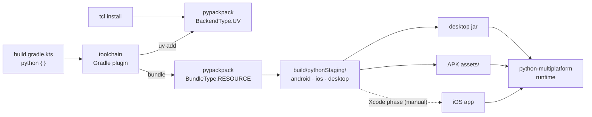

English | [한국어](docs/locale/README_ko.md)

<div align="center">

# toolchain

**Declare the Python half of your Kotlin Multiplatform app in Gradle — and ship it.**

[](LICENSE)


[Guide](docs/guide/index.html) · [Getting started](docs/guide/getting-started.html) · [Status](docs/guide/status.html) · [Ecosystem](docs/guide/ecosystem.html)

</div>

---

## 💡 Why

A Kotlin Multiplatform app that embeds Python has two builds to keep in step: the Kotlin one Gradle
already understands, and a Python one — interpreter version, packages, per-platform bundles,
assets — that it does not. `toolchain` is the Gradle plugin that closes the gap. You write one
`python { }` block next to your `kotlin { }` block; the build installs your Python dependencies,
bundles your code per target, and puts the payload where each platform's packaging step picks it up.

It does that by **delegating, not reimplementing**: dependency resolution and bundling are done by
[`pypackpack`](https://github.com/thisisthepy/pypackpack) (with `uv` underneath), and the payload is
run by [`python-multiplatform`](https://github.com/thisisthepy/python-multiplatform). `toolchain`
owns the Gradle vocabulary in between.

## ✨ Features

- 🧩 **One DSL block** — `compileSdk`, platforms, `buildTypes`, `sourceSets` and `packaging`, all
  inside `python { }`.
- 📦 **Real dependency installs** — `implementation("pkg")` and `integration("pkg")` become a real
  `uv add` through `pypackpack`.
- 🚀 **A task per variant** — every platform variant × build type gets its own
  `buildPython<Variant><BuildType>` / `packagePython<Variant><BuildType>`, and an unsupported one
  fails alone.
- 🔌 **Lands in the artifact** — the bundle is staged into the desktop jar's resources and the
  APK's `assets/`.
- 🧪 **Loud, not silent** — an unknown version string, an unmapped platform or an unsupported
  compile level is rejected with a message saying why, instead of compiling and doing nothing.
- 🐍 **`tcl` for Python users** — `tcl install <package>`, no Gradle project needed.

## 🚀 Quick start

> `toolchain` is pre-release and published to Maven Local only. Publish `pypackpack`'s `packpack`
> artifact and this plugin locally first, and have `uv` on your `PATH`.

```shell
# in pypackpack:  ./gradlew :packpack:publishToMavenLocal
./gradlew :toolchain:publishToMavenLocal
```

Apply the plugin next to Kotlin Multiplatform and point it at a `pypackpack` package. This is
`usage-example/build.gradle.kts`, trimmed:

```kotlin
plugins {
    alias(libs.plugins.kotlin.multiplatform)
    alias(libs.plugins.android.application)
    id("org.thisisthepy.python.multiplatform") version "1.0.0-alpha"
}

python {
    compileSdk = "3.13"
    localLibraryPath = "python"      // a pypackpack package: pyproject.toml + src/main/<pkg>
    packaging {
        fileName = "usage-example"
    }
}
```

```shell
./gradlew :usage-example:packagePython        # install → bundle → zip
./gradlew :usage-example:stagePythonBundle    # stage python/ for android, ios and desktop
```

Want one bundle per target? Declare platforms and build types:

```kotlin
python {
    android("android") { androidSdk = 24 }
    listOf(androidArm64(), androidX64())
    desktop()
    listOf(macosArm64(), linuxX64())
    buildTypes {
        getByName("debug") { compileLevel = "instant" }
    }
}
// → buildPythonAndroidArm64Debug, packagePythonMacosArm64Debug, …
```

Python only? Skip Gradle builds entirely:

```shell
./gradlew :tcl:run --args="install pythonx-compose"
```

## 🧭 Architecture at a glance



## 📊 Status

An honest summary — the full contract, item by item, is on the guide's
[Status page](docs/guide/status.html).

| Area | State |
|---|---|
| `compileSdk` parsing (alpha / rc / normal) | ✅ implemented |
| Platforms → target triples, Kotlin target cross-check, min SDK | ✅ implemented |
| `debug` / `release` and the per-variant task graph | ✅ implemented |
| `implementation` / `integration` dependencies via `uv` | ✅ implemented — not yet per source set |
| Bundling via `pypackpack` at the `instant` level | ✅ implemented |
| `bytecode` / `native` / `mixed` compile levels | ⏳ planned — rejected loudly today |
| Staging into the desktop jar and the APK | 🟡 partial — iOS is staged but not attached |
| Hot reload | 🟡 partial — Android only, over `adb` |
| Code push | 🟡 partial — validation only, no upload |
| `embedLevel`, `buildFeatures`, `projectFlavors`, `pip { }` | ⏳ planned |
| `tcl install` | ✅ implemented |

## 📖 Documentation

- **[Guide](docs/guide/index.html)** — concepts, task guides, status, in English and 한국어.
- **[한국어 README](docs/locale/README_ko.md)**

## 🤝 Contributing

Work here runs intent → spec → test → code: a behaviour change starts as a spec change, and its test
is written and seen failing before the implementation. The guide's
[contributing notes](docs/guide/status.html#contributing) say how to run the tests.

## 📄 License

[MIT](LICENSE) © 2024 thisisthepy
