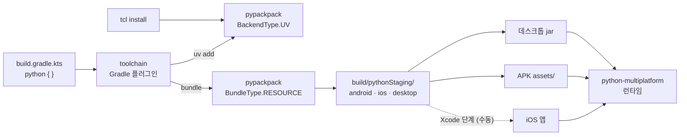

[English](../../README.md) | 한국어

<div align="center">

# toolchain

**Kotlin Multiplatform 앱의 Python 절반을 Gradle 에 선언하고, 그대로 배포하세요.**

[](../../LICENSE)


[가이드](../guide/index.html) · [시작하기](../guide/getting-started.html) · [상태](../guide/status.html) · [생태계](../guide/ecosystem.html)

</div>

---

## 💡 왜 필요한가

Python 을 내장한 Kotlin Multiplatform 앱에는 맞물려 돌아가야 하는 빌드가 둘 있습니다. Gradle 이
이미 아는 Kotlin 빌드, 그리고 Gradle 이 모르는 Python 빌드 — 인터프리터 버전, 패키지, 플랫폼별
번들, 에셋 — 입니다. `toolchain` 은 그 간극을 메우는 Gradle 플러그인입니다. `kotlin { }` 블록 옆에
`python { }` 블록 하나를 쓰면, 빌드가 Python 의존성을 설치하고, 타깃마다 코드를 번들링하고, 각
플랫폼의 패키징 단계가 가져갈 자리에 페이로드를 놓습니다.

방식은 **재구현이 아니라 위임**입니다. 의존성 해석과 번들링은
[`pypackpack`](https://github.com/thisisthepy/pypackpack) (내부적으로 `uv`) 이 하고, 페이로드 실행은
[`python-multiplatform`](https://github.com/thisisthepy/python-multiplatform) 이 맡습니다.
`toolchain` 은 그 사이의 Gradle 어휘를 맡습니다.

## ✨ 기능

- 🧩 **DSL 블록 하나** — `compileSdk`, 플랫폼, `buildTypes`, `sourceSets`, `packaging` 을 모두
  `python { }` 안에.
- 📦 **실제 의존성 설치** — `implementation("pkg")` 와 `integration("pkg")` 가 `pypackpack` 을 거쳐
  실제 `uv add` 가 됩니다.
- 🚀 **변형마다 태스크 하나** — 플랫폼 변형 × 빌드 타입마다
  `buildPython<Variant><BuildType>` / `packagePython<Variant><BuildType>` 가 생기고, 지원되지 않는
  변형은 그것만 실패합니다.
- 🔌 **산출물에 실제로 들어감** — 번들이 데스크톱 jar 의 리소스와 APK 의 `assets/` 로 스테이징됩니다.
- 🧪 **조용히 넘어가지 않음** — 알 수 없는 버전 문자열, 매핑되지 않는 플랫폼, 지원되지 않는 컴파일
  레벨은 컴파일만 되고 아무 일도 안 하는 대신, 이유를 밝히며 거부됩니다.
- 🐍 **Python 사용자를 위한 `tcl`** — Gradle 프로젝트 없이 `tcl install <package>`.

## 🚀 빠른 시작

> `toolchain` 은 정식 출시 전이며 Maven Local 에만 배포됩니다. `pypackpack` 의 `packpack`
> 아티팩트와 이 플러그인을 먼저 로컬에 배포하고, `PATH` 에 `uv` 가 있어야 합니다.

```shell
# pypackpack 에서:  ./gradlew :packpack:publishToMavenLocal
./gradlew :toolchain:publishToMavenLocal
```

Kotlin Multiplatform 옆에 플러그인을 적용하고 `pypackpack` 패키지를 가리키게 합니다. 아래는
`usage-example/build.gradle.kts` 를 줄인 것입니다.

```kotlin
plugins {
    alias(libs.plugins.kotlin.multiplatform)
    alias(libs.plugins.android.application)
    id("org.thisisthepy.python.multiplatform") version "1.0.0-alpha"
}

python {
    compileSdk = "3.13"
    localLibraryPath = "python"      // pypackpack 패키지: pyproject.toml + src/main/<pkg>
    packaging {
        fileName = "usage-example"
    }
}
```

```shell
./gradlew :usage-example:packagePython        # 설치 → 번들 → zip
./gradlew :usage-example:stagePythonBundle    # android, ios, desktop 용 python/ 스테이징
```

타깃마다 번들을 따로 만들고 싶다면 플랫폼과 빌드 타입을 선언합니다.

```kotlin
python {
    android("android") { androidSdk = 24 }
    listOf(androidArm64(), androidX64())
    desktop()
    listOf(macosArm64(), linuxX64())
    buildTypes {
        getByName("debug") { compileLevel = "instant" }
    }
}
// → buildPythonAndroidArm64Debug, packagePythonMacosArm64Debug, …
```

Python 만 쓰나요? Gradle 빌드 없이:

```shell
./gradlew :tcl:run --args="install pythonx-compose"
```

## 🧭 한눈에 보는 구조



## 📊 현재 상태

솔직한 요약입니다. 항목별 전체 계약은 가이드의 [상태 페이지](../guide/status.html)에 있습니다.

| 영역 | 상태 |
|---|---|
| `compileSdk` 파싱 (alpha / rc / normal) | ✅ 구현됨 |
| 플랫폼 → 타깃 트리플, Kotlin 타깃 대조, 최소 SDK | ✅ 구현됨 |
| `debug` / `release` 와 변형별 태스크 그래프 | ✅ 구현됨 |
| `uv` 를 통한 `implementation` / `integration` 의존성 | ✅ 구현됨 — 소스셋별 구분은 아직 |
| `instant` 레벨의 `pypackpack` 번들링 | ✅ 구현됨 |
| `bytecode` / `native` / `mixed` 컴파일 레벨 | ⏳ 계획 — 현재는 명시적으로 거부 |
| 데스크톱 jar 와 APK 로의 스테이징 | 🟡 부분 — iOS 는 스테이징만 되고 연결되지 않음 |
| 핫 리로드 | 🟡 부분 — Android 전용, `adb` 경유 |
| 코드 푸시 | 🟡 부분 — 검증만, 업로드 없음 |
| `buildFeatures { metaclass, compose }` | ✅ 구현됨 — compose 위치는 Gradle 속성 두 개로 지정 |
| `embedLevel`, `projectFlavors`, `pip { }` | ⏳ 계획 |
| `tcl install` | ✅ 구현됨 |

## 📖 문서

- **[가이드](../guide/index.html)** — 개념, 작업별 가이드, 상태. 영어와 한국어.
- **[English README](../../README.md)**

## 🤝 기여

이 저장소의 작업은 의도 → 스펙 → 테스트 → 코드 순서로 진행합니다. 동작을 바꾸려면 스펙부터
바꾸고, 그 테스트를 먼저 작성해 실패하는 것을 확인한 뒤 구현합니다. 테스트 실행 방법은 가이드의
[기여 안내](../guide/status.html#contributing)에 있습니다.

## 📄 라이선스

[MIT](../../LICENSE) © 2024 thisisthepy
